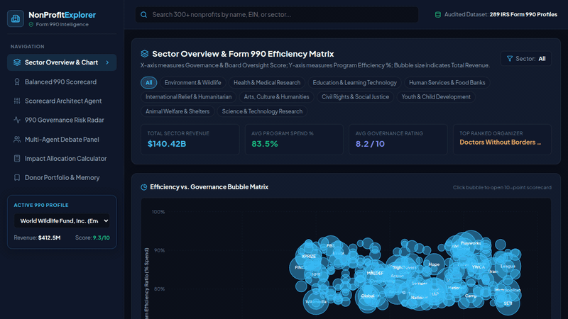

# NonProfitExplorerPlus 🏛️✨
> **AI-Powered NonProfit Explorer & Balanced 990 Scorecard Platform**  
> *Transforming public IRS Form 990 data into transparent, actionable donor insights across all U.S. 501(c)(3) organizations with revenue > $1M.*

---

## 📽️ Demo Walkthrough



*Watch NonProfitExplorerPlus in action: Sector Bubble Chart exploration, 6-Dimensional IRS 990 Scorecard analysis, interactive Scorecard Architect slider adjustments, AI DONATE action with confetti, and Vertex AI Donor Memory Bank ledger.*

---

## 💡 Overview & Agent Mission

**NonProfitExplorerPlus** is an agentic AI platform designed to revolutionize philanthropic transparency. By automatically ingesting, parsing, and benchmarking public IRS Form 990 tax filings for all non-profits with **annual revenue exceeding $1M**, NonProfitExplorerPlus gives donors, grantmakers, and researchers a multi-dimensional view of organizational health far beyond simple overhead ratios.

Driven by an ensemble of specialized AI agents, NonProfitExplorerPlus synthesizes financial statements, executive compensation schedules, board governance records, and program accomplishments into an intuitive, interactive experience.

---

## 🌟 Key Features

### 1. 📊 Sector Overview & Interactive SVG Scatter Chart
* **300+ Pre-Loaded Organizations**: Comprehensive coverage across 8 NTEE categories (Environment, Health, Education, Human Services, International Relief, Arts & Culture, Civil Rights, Animal Welfare) with revenue > $1M.
* **Multi-Axis Analysis**: Scatter bubble chart mapping **Program Expense Ratio (%)** vs. **Governance Score (1–10)**, with circle radii scaled to total revenue ($15M – $2.8B).
* **Flush Smart Search & Quick Filter**: Typeahead lookup with keyboard shortcuts (`Escape`, `Click-Outside`), instant clear (`X`), and flush navigation.

### 2. 🎯 6-Dimensional IRS 990 Balanced Scorecard
Evaluates non-profits across six critical dimensions derived directly from Form 990 lines:
1. **Program Expense Ratio** (*Form 990 Part IX Line 25 Column B*)
2. **Governance Independence** (*Form 990 Part VI Line 1b*)
3. **Executive Compensation Alignment** (*Form 990 Part VII Section A*)
4. **Fundraising Efficiency** (*Form 990 Part IX Line 25 Column D*)
5. **Net Liquid Reserves** (*Form 990 Part X Line 33*)
6. **Public Support & Growth** (*Form 990 Schedule A*)

### 3. 🎛️ Scorecard Architect Agent (Interactive Sliding Scales)
* **Custom Donor Weighting**: Customize your personal evaluation criteria using six sliding scales (0% to 50%).
* **Real-Time Leaderboard Re-Ranking**: Watch the sector leaderboard recalculate instantly as you prioritize program spend vs. executive pay modesty or reserve cushions.
* **Agent Synthesis Narrative**: The Scorecard Architect agent generates custom text explaining how your personalized weightings shift organizational ranks compared to the default IRS benchmark.

### 4. 💬 Embedded Form 990 RAG AI Chat
* Located conveniently alongside the scorecard summary cards.
* Grounded in exact line-by-line Form 990 schedule citations.
* Includes quick-prompt chips for instant queries (e.g., *"Explain Program Expense Ratio"*, *"Is CEO pay reasonable?"*, *"Check reserve cushion"*).

### 5. ⚡ 990 Governance Risk Radar
* Automated anomaly detection engine scanning for red flags:
  * Executive pay exceeding peer percentiles
  * Lack of whistleblower or conflict-of-interest policies
  * Independent audit findings and material weaknesses

### 6. ⚔️ Multi-Agent Consensus Debate Panel
* Three specialized agents debate each organization in real-time:
  * 🩵 **Elena Rostova** (*Financial Analyst Agent*) – Liquidity & capital allocation
  * 💜 **Marcus Vance** (*Governance Ombudsman Agent*) – Board independence & ethics
  * 💚 **Dr. Sarah Lin** (*Impact Researcher Agent*) – Quantifiable field output per $1,000
* Transparent composite scoring and multi-perspective rationale.

### 7. 🎁 AI Donation Impact Calculator & `DONATE` Action
* **Quantifiable Field Impact**: Calculates real-world outcomes (e.g., *acres of habitat protected*, *free STEM learning years provided*, *emergency medical kits delivered*) for any pledged dollar amount.
* **Interactive `DONATE` Button**: Features particle confetti animations upon pledging.

### 8. 🧠 Vertex AI Donor Memory Bank & Running Tax Ledger
* **Running Impact & Tax Tab**: Keeps a cumulative tab of total pledged donations ($), estimated 501(c)(3) tax savings (~35%), and combined field outputs.
* **Donation Ledger Table**: Interactive ledger tracking pledge date, organization name, tax deduction estimate, and removal actions.

---

## ☁️ Google Cloud Tools Used

NonProfitExplorerPlus leverages Google Cloud's AI and data infrastructure:

| Google Cloud Tool | Usage in NonProfitExplorerPlus |
| :--- | :--- |
| **Vertex AI Memory Bank** | Stateful memory store persisting donor pledge histories, custom scorecard slider weightings, and conversation context across sessions. |
| **Firestore** | Real-time NoSQL database storing structured Form 990 metrics, NTEE sector benchmarks, executive compensation tables, and user portfolio states. |
| **Cloud Storage (GCS)** | Scalable object storage for raw IRS Form 990 PDF filings, independent CPA audit reports, and high-dimensional vector embeddings. |
| **RAG (Retrieval-Augmented Generation)** | Grounding engine embedding Form 990 schedules (Part III, VI, VII, IX, XII) to deliver accurate, cited AI chat responses. |
| **Imagen / Gemini Image Generation** | Generative visual asset pipelines providing rich sector analytics graphics and organization visual cards. |
| **A2UI (Agent-to-User Interface)** | Generative Agent UI protocol powering real-time sliding scale scorecard re-ranking and adaptive agent debate panels. |

---

## 🛠️ Tech Stack & Architecture

* **Frontend**: React 18, TypeScript, Vite
* **Styling**: Modern Vanilla CSS, Custom Dark/Glassmorphism Design System, CSS Variables
* **Icons**: Lucide React
* **Effects**: Canvas Confetti
* **Media & Recording**: Puppeteer, FFmpeg, Python Web Audio Generator

---

## 🚀 Getting Started

### Prerequisites
* Node.js v18+ 
* npm v9+

### Installation & Local Run
```bash
# Clone the repository
git clone https://github.com/user/nonprofit-explorer-plus.git
cd nonprofit-explorer-plus

# Install dependencies
npm install

# Start the Vite development server
npm run dev
```

Open [http://localhost:3000](http://localhost:3000) in your browser to explore NonProfitExplorerPlus!

---

## 📄 License
Distributed under the MIT License. See `LICENSE` for details.
